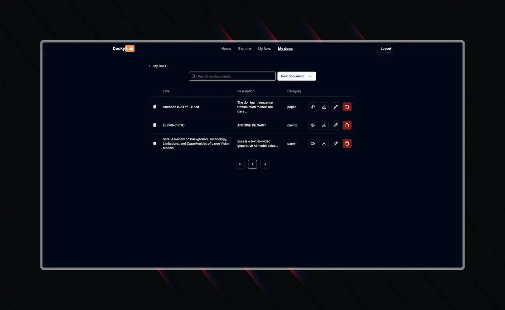
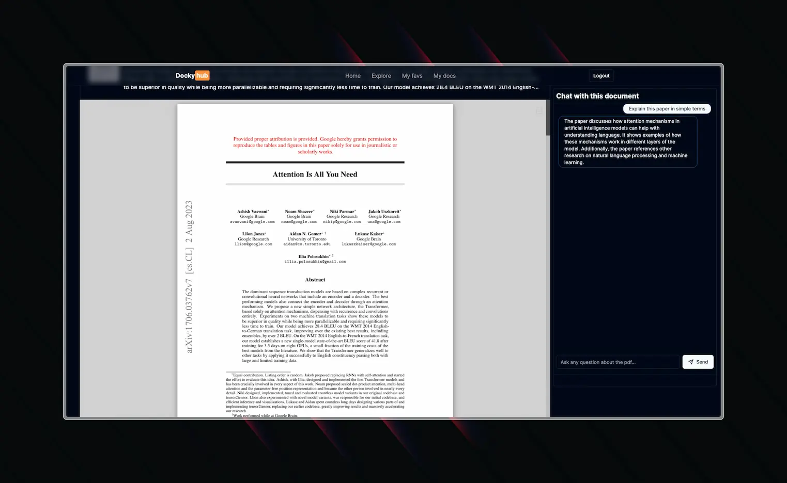

Dockyhub is an platform designed specifically for university professors to share class documents seamlessly. This platform provides an efficient way for educators to upload, organize, and distribute educational materials, ensuring that students have easy access to all necessary resources.

One of Dockyhub's standout features is its integrated chat functionality. Professors and students can interact directly with the uploaded documents, enabling real-time discussions, clarifications, and collaborative learning. This chat feature leverages advanced natural language processing technology, allowing users to ask questions and receive contextual answers based on the document content.

